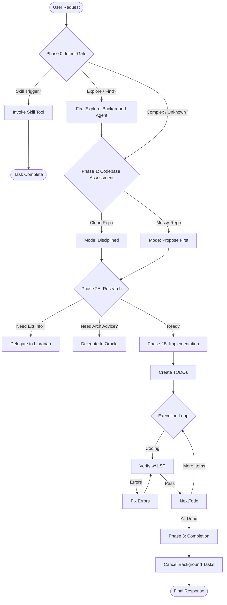
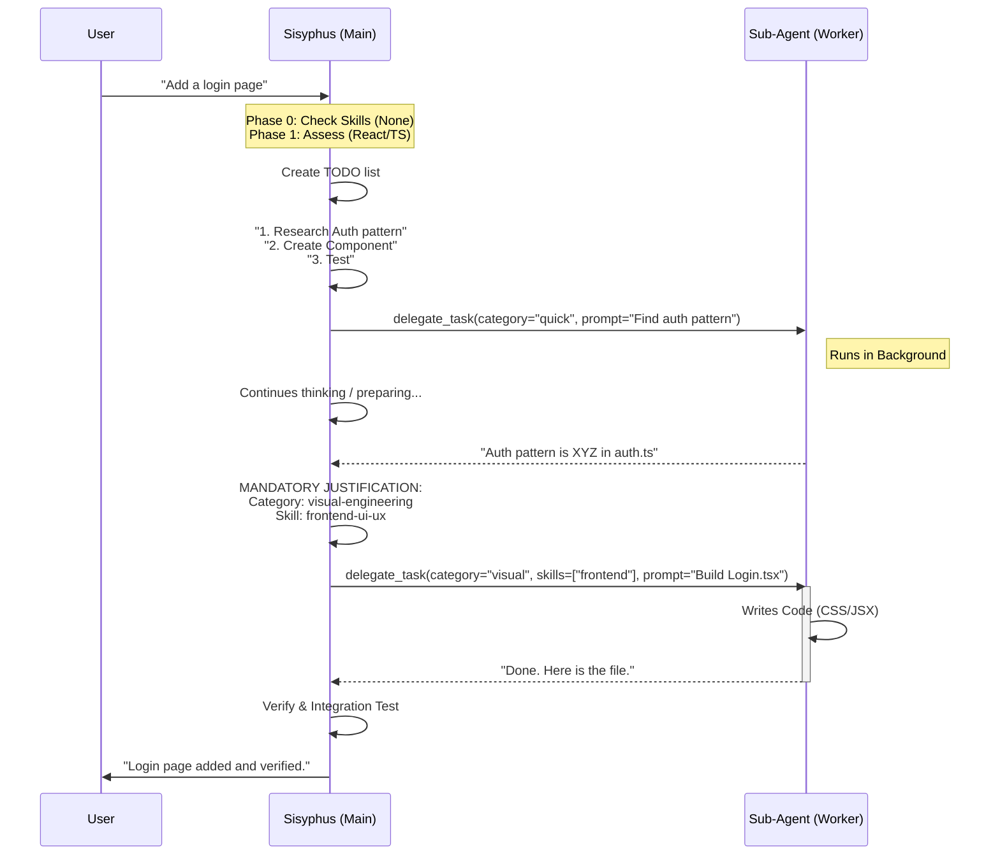
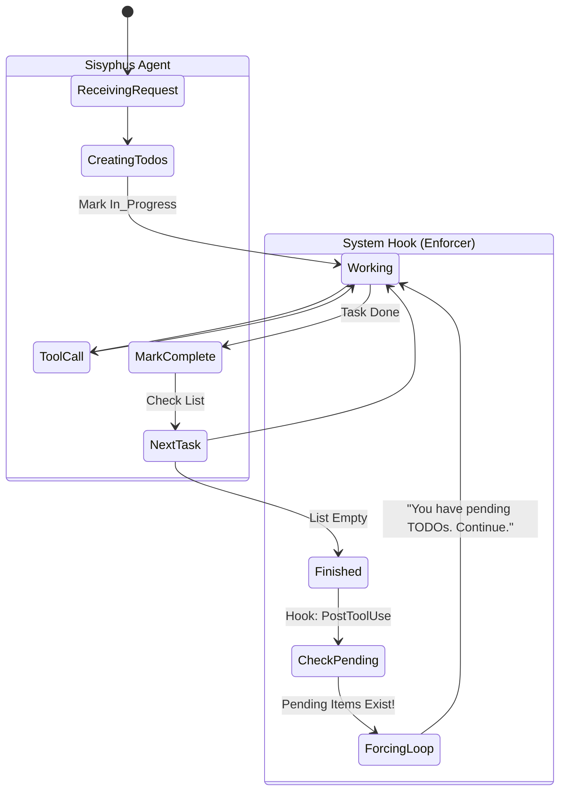

# Orchestration Visuals

Visualizing the decision flow of the Sisyphus agent in Oh My OpenCode.

## 1. The Core Loop (Phase 0 -> Phase 3)

## 2. Delegation Logic (Sisyphus vs Sub-Agents)

## 3. The Persistence Loop (Todo Enforcer)

