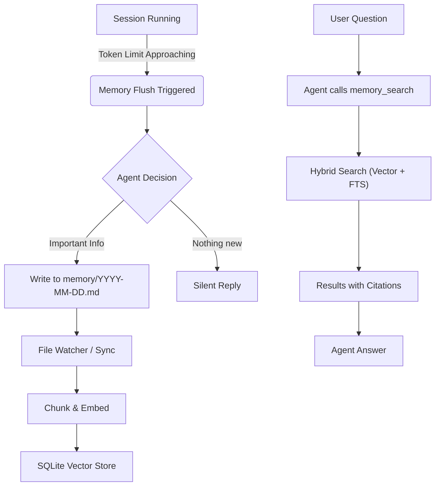

# 03: Memory System

**Automated Lifecycle: Write → Index → Search → Recall**

OpenClaw implements a sophisticated "Memory Flush" architecture where the agent is prompted to save durable memories *before* the session context window fills up.

---

## 1. Memory Creation (The Flush Cycle)

Memory files are not just logs; they are **proactively created** by the agent during specific lifecycle events.

### The "Memory Flush" Trigger
**Code:** `runMemoryFlushIfNeeded` in `src/auto-reply/reply/agent-runner-memory.ts`

1.  **Detection:**
    *   The system monitors session token usage (`sessionEntry.totalTokens`).
    *   It calculates a **Threshold**: `ContextWindow - ReserveTokens - SoftThreshold`.
    *   If `totalTokens > threshold`, a **Flush** is triggered.

2.  **Execution:**
    *   A special "Flush Run" is spawned (`runEmbeddedPiAgent`).
    *   **System Prompt:** "Pre-compaction memory flush turn. The session is near auto-compaction; capture durable memories to disk."
    *   **Goal:** The agent must now write to `memory/YYYY-MM-DD.md` or `MEMORY.md` to save important context before the main session compacts (forgets) recent messages.

3.  **Persistence:**
    *   The agent uses standard `write` or `edit` tools to update the markdown files.
    *   If no update is needed, it replies `¿¿silent`.

### Manual Creation
*   **Daily Notes:** `memory/YYYY-MM-DD.md` files are typically created by the agent when it decides to log an event or when instructed by the "Flush" prompt.
*   **Long-Term Memory:** `MEMORY.md` is updated manually by the agent (e.g., during Heartbeats or Flushes) to distill lessons.

---

## 2. Memory Indexing (Hybrid Search)

**Code:** `syncMemoryFiles` in `src/memory/sync-memory-files.ts`

OpenClaw maintains a **SQLite database** (`~/.openclaw/state/memory/<agent>.sqlite`) that indexes all memory files.

### Indexing Process
1.  **Discovery:** Scans `memory/` directory and `MEMORY.md`.
2.  **Chunking:** Splits content into chunks (default: 400 tokens, 80 overlap).
3.  **Embedding:** Generates vector embeddings for each chunk using:
    *   **OpenAI:** `text-embedding-3-small` (default)
    *   **Gemini:** `gemini-embedding-001`
    *   **Local:** Supported via `local` provider config.
4.  **FTS (Full Text Search):** Also indexes chunks for lexical search.

### Triggering Sync
*   **On Session Start:** `sync.onSessionStart: true`
*   **On Search:** `sync.onSearch: true` (ensures fresh results)
*   **Watcher:** Can watch file changes in real-time (`watchDebounceMs: 1500`).

---

## 3. Memory Retrieval (On-the-Fly)

**Tools:** `memory_search` and `memory_get` (`src/agents/tools/memory-tool.ts`)

### A. The Search Tool (`memory_search`)
*   **Usage:** `memory_search(query: string, maxResults?: number, minScore?: number)`
*   **Logic:** Performs a **Hybrid Search** (Vector + Keyword).
    *   **Vector Score:** Semantic similarity (Weight ~0.7).
    *   **Text Score:** Keyword match (Weight ~0.3).
    *   **Hybrid Formula:** `(VectorScore * VectorWeight) + (TextScore * TextWeight)`.
*   **Filtering:**
    *   Returns top results (default `DEFAULT_MAX_RESULTS = 6`).
    *   Filters out results below `DEFAULT_MIN_SCORE` (0.35) to reduce noise.
*   **Citations:** Decorates results with file path and line numbers (e.g., `memory/2026-01-26.md#L10-L15`).
    *   **Auto-Citation Mode:** In Direct Messages (Main Session), citations are shown. In Group Chats, they are hidden to reduce visual noise (`shouldIncludeCitations`).

### B. The Get Tool (`memory_get`)
*   **Usage:** `memory_get(path: string, from?: number, lines?: number)`
*   **Purpose:** Surgical reading to expand context or verify details found in search.
*   **Workflow:**
    1.  **Search First:** Agent runs `memory_search("deployment process")`.
    2.  **Analyze Snippet:** System returns a truncated snippet from `memory/2026-01-20.md` lines 50-55.
    3.  **Expand Context:** Agent realizes the snippet is cut off or references surrounding text.
    4.  **Surgical Read:** Agent runs `memory_get("memory/2026-01-20.md", 40, 30)` to read lines 40-70.
    5.  **Result:** Returns the exact text content of those lines, minimizing token usage compared to reading the whole file.

---

## 4. Lifecycle Summary

## Key Configuration (`ResolvedMemorySearchConfig`)

| Setting | Default | Description |
|---------|---------|-------------|
| `chunking.tokens` | 400 | Size of text chunks for embedding |
| `sync.watch` | true | Real-time indexing of file edits |
| `query.hybrid.vectorWeight` | 0.7 | Importance of semantic match |
| `query.hybrid.textWeight` | 0.3 | Importance of keyword match |
| `experimental.sessionMemory` | false | Index session transcripts (JSONL) too |

---

**Report Generated By:** Antigravity AI (Sisyphus Agent)
**Source:** Codebase analysis of `src/memory/` and `src/auto-reply/reply/`
