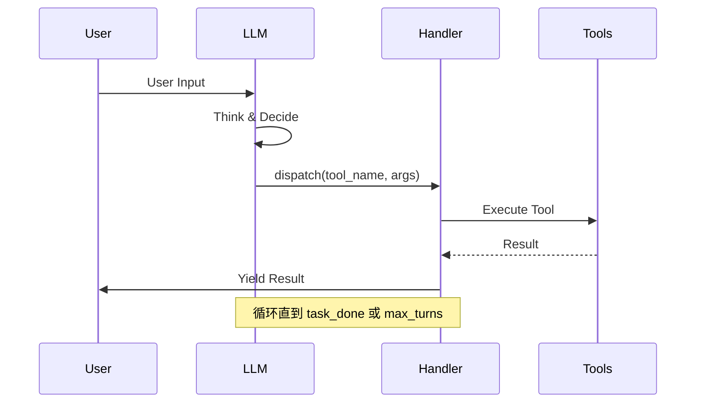
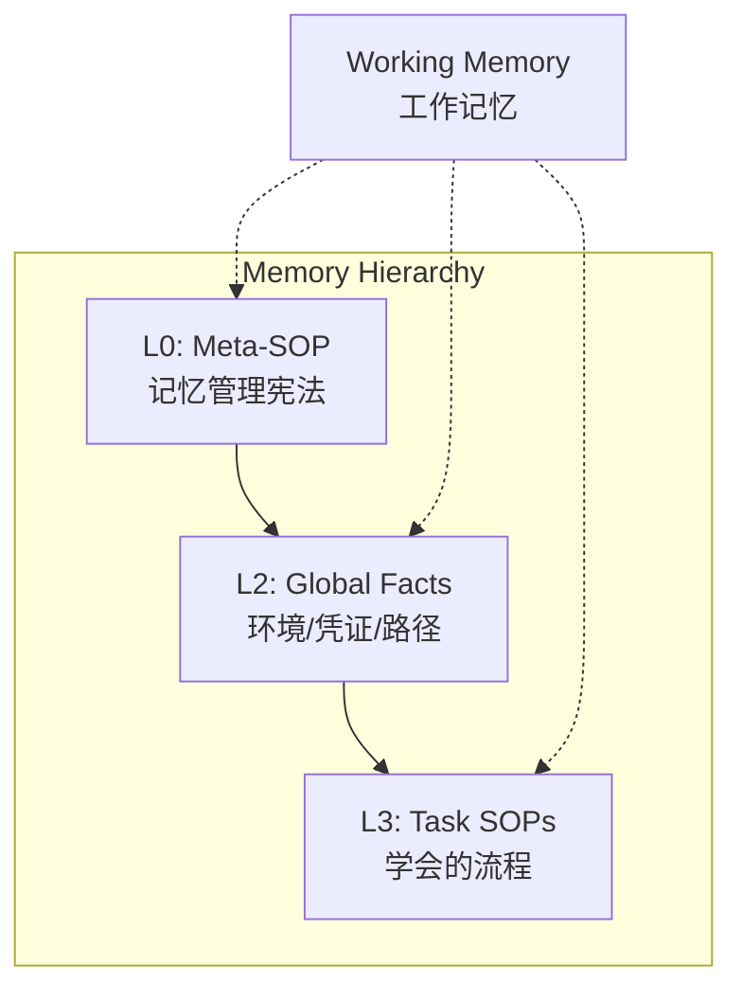

# 03: Agent Loop & Memory System

GenericAgent 的核心循环非常精简（仅 92 行），但配合多层记忆系统实现了强大的自主能力。

---

## 1. 核心循环 - agent_loop.py



### 循环流程

```python
def agent_runner_loop(client, system_prompt, user_input, handler, tools_schema, max_turns=15):
    messages = [
        {"role": "system", "content": system_prompt},
        {"role": "user", "content": user_input}
    ]
    
    for turn in range(max_turns):
        # 1. LLM 推理
        response = client.chat(messages=messages, tools=tools_schema)
        
        # 2. 解析工具调用
        tool_name = response.tool_calls[0].function.name
        args = json.loads(...)
        
        # 3. 执行工具
        outcome = handler.dispatch(tool_name, args, response)
        
        # 4. 检查结果
        if outcome.should_exit: return
        if outcome.next_prompt is None: return {'result': 'CURRENT_TASK_DONE'}
        
        # 5. 构造下一轮输入
        messages = [{"role": "user", "content": next_prompt}]
    
    return {'result': 'MAX_TURNS_EXCEEDED'}
```

### 关键机制

1. **每 10 轮重置工具描述**：避免上下文膨胀导致模型性能下降
2. **next_prompt_patcher**：每轮可注入额外提示
3. **danger 机制**：
   - 第 7 轮：警告禁止无效重试
   - 第 30 轮：强制要求 ask_user

---

## 2. 多层记忆系统

GenericAgent 采用 **Tiered Memory** 设计，类似于操作系统的内存层次：



### L0: Meta-SOP - 记忆管理宪法

**文件**：`memory/memory_management_sop.md`

定义 Agent 如何管理自己的记忆：
- 何时更新长期记忆
- 如何提炼重要信息
- 记忆分层的原则

### L2: Global Facts - 环境事实

**文件**：
- `memory/global_mem_insight.txt`
- `assets/insight_fixed_structure.txt`

存储：
- 环境路径
- 凭证/配置
- 用户偏好
- 可用工具状态

### L3: Task SOPs - 任务流程

**目录**：`memory/`

Agent 学会的每个任务流程：
- Gmail 发送流程
- WeChat 自动化
- 股票分析工作流
- 任何用户教它的新技能

---

## 3. 记忆更新机制

### update_working_checkpoint

```python
def do_update_working_checkpoint(self, args, response):
    key_info = args.get("key_info", "")      # 当前任务重点
    related_sop = args.get("related_sop", "") # 相关 SOP
```

在任务执行过程中更新**工作记忆**。

### start_long_term_update

```python
def do_start_long_term_update(self, args, response):
    # 提取事实验证成功的信息
    # - 环境事实 → 更新 L2
    # - 复杂经验 → 精简 SOP 到 L3
```

任务完成后将重要信息写入**长期记忆**。

### SOP 约束

**禁止**记录：
- 临时变量
- 具体推理过程
- 未验证信息
- 通用常识

**只记录**：
- 验证成功的环境事实
- 被坑过多次的核心要点
- 路径/凭证/配置

---

## 4. 工作记忆 - Working Memory

每次工具调用后，Handler 会生成**锚点提示**：

```python
def _get_anchor_prompt(self):
    h_str = "\n".join(self.history_info[-20:])
    prompt = f"""
### [WORKING MEMORY]
<history>
{h_str}
</history>
"""
    if self.key_info:
        prompt += f"\n<key_info>{self.key_info}</key_info>"
    if self.related_sop:
        prompt += f"\n有不清晰的地方请再次读取{self.related_sop}"
    return prompt
```

**包含**：
- 最近 20 条历史（摘要）
- 当前任务重点（key_info）
- 相关 SOP 引用

---

## 5. 任务完成与停止条件

| 条件 | 处理 |
|------|------|
| `outcome.next_prompt is None` | `CURRENT_TASK_DONE` |
| `outcome.should_exit == True` | `EXITED`（ask_user 触发）|
| 达到 `max_turns` (15) | `MAX_TURNS_EXCEEDED` |

### Danger 机制

```python
# 第 7 轮
"[DANGER] 已连续执行第 7 轮。禁止无效重试..."

# 第 30 轮
"[DANGER] 已连续执行第 30 轮。你必须总结情况进行 ask_user"
```

---

## 6. 5 个核心 SOP

| SOP | 功能 |
|-----|------|
| `memory_management_sop` | L0 宪法：如何管理记忆 |
| `autonomous_operation_sop` | 自主任务执行 |
| `scheduled_task_sop` | 定时/周期任务 |
| `web_setup_sop` | 浏览器环境引导 |
| `ljqCtrl_sop` | 桌面物理控制（键鼠、DPI）|

这些 SOP 是"种子"，Agent 基于它们自我进化。

---

## 7. 自举示例

```
用户："帮我读取微信消息"
Agent：
  1. 安装依赖（requests、pycryptodome）
  2. 逆向微信数据库
  3. 编写读取脚本
  4. 保存为 SOP：「微信消息读取 SOP」
  
下次用户再说同样的话：
  Agent：直接调用 SOP，秒级响应
```

这就是 GenericAgent 的**自我进化**能力——用得越多，技能树越丰富。
